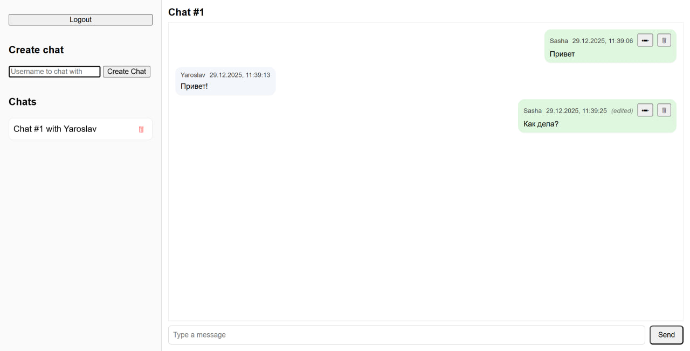

# Chat App
Chat App — это веб-приложение для обмена сообщениями в реальном времени. Проект реализует личные чаты между пользователями с поддержкой создания, редактирования и удаления сообщений, а также удаления самих чатов.



# Стек технологий
## Backend
Java 23, Spring Boot, Spring Web (REST API), Spring WebSocket (STOMP поверх SockJS), Spring Data JPA, PostgreSQL 17, Hibernate
## Frontend
HTML, CSS, JavaScript, WebSocket (STOMP)
## Инфраструктура
Docker, Maven

# Основная функциональность

- Регистрация и логин пользователей по username
- Создание личных чатов (в том числе чат с самим собой)
- Отправка сообщений
- Редактирование сообщений (с отметкой edited)
- Удаление сообщений
- Удаление чатов
- Обновление сообщений и списка чатов в реальном времени
- Возможность выхода из аккаунта и повторного входа

## Тестирование

В проекте присутствуют интеграционные тесты, проверяющие корректность работы REST-эндпоинтов и взаимодействие с базой данных.

# Запуск проекта

```docker compose up --build```

После успешного запуска frontend будет доступен по адресу http://localhost:8080, а REST API по адресу http://localhost:8080/api. База данных PostgreSQL будет поднята автоматически.
